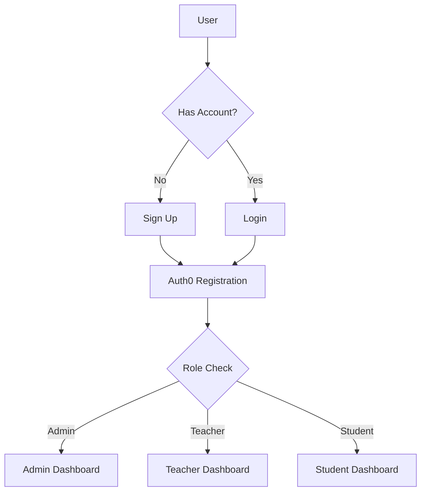
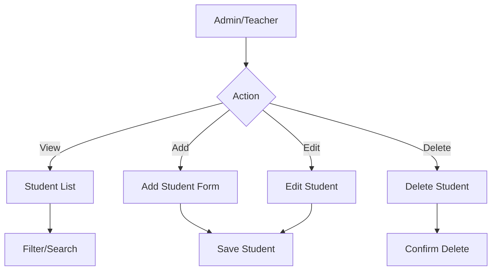
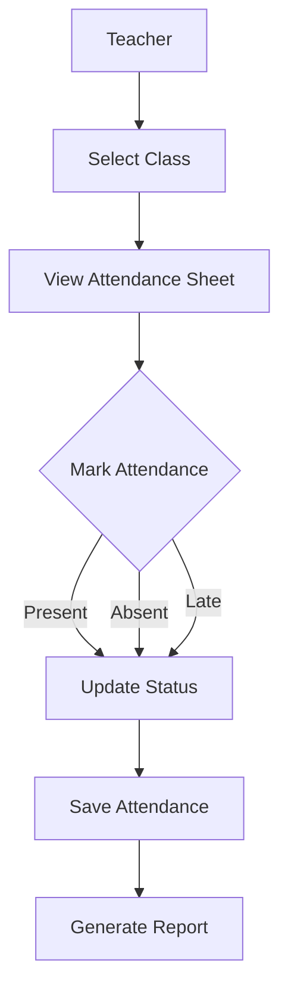
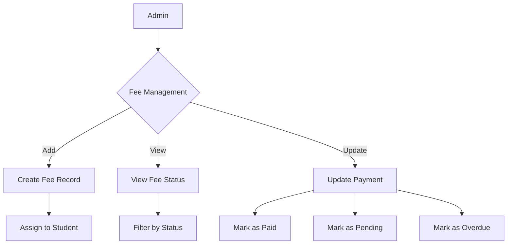
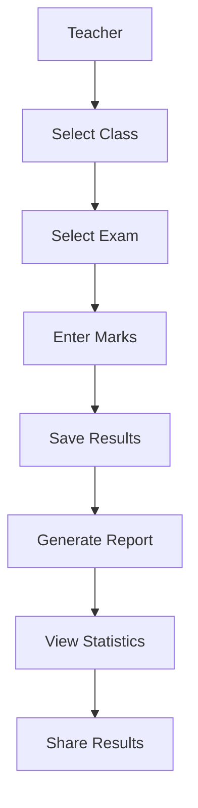

# School Management System Flow Charts

## Authentication Flow

```mermaid
graph TD
    A[User] --> B{Has Account?}
    B -->|No| C[Sign Up]
    B -->|Yes| D[Login]
    C --> E[Auth0 Registration]
    D --> E
    E --> F{Role Check}
    F -->|Admin| G[Admin Dashboard]
    F -->|Teacher| H[Teacher Dashboard]
    F -->|Student| I[Student Dashboard]
```

## Student Management Flow

```mermaid
graph TD
    A[Admin/Teacher] --> B{Action}
    B -->|View| C[Student List]
    B -->|Add| D[Add Student Form]
    B -->|Edit| E[Edit Student]
    B -->|Delete| F[Delete Student]
    C --> G[Filter/Search]
    D --> H[Save Student]
    E --> H
    F --> I[Confirm Delete]
```

## Attendance Management Flow

```mermaid
graph TD
    A[Teacher] --> B[Select Class]
    B --> C[View Attendance Sheet]
    C --> D{Mark Attendance}
    D -->|Present| E[Update Status]
    D -->|Absent| E
    D -->|Late| E
    E --> F[Save Attendance]
    F --> G[Generate Report]
```

## Fee Management Flow

```mermaid
graph TD
    A[Admin] --> B{Fee Management}
    B -->|Add| C[Create Fee Record]
    B -->|View| D[View Fee Status]
    B -->|Update| E[Update Payment]
    C --> F[Assign to Student]
    D --> G[Filter by Status]
    E --> H[Mark as Paid]
    E --> I[Mark as Pending]
    E --> J[Mark as Overdue]
```

## Exam Results Flow

```mermaid
graph TD
    A[Teacher] --> B[Select Class]
    B --> C[Select Exam]
    C --> D[Enter Marks]
    D --> E[Save Results]
    E --> F[Generate Report]
    F --> G[View Statistics]
    G --> H[Share Results]
```
